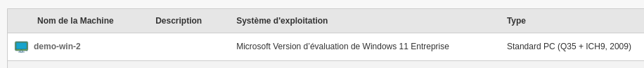
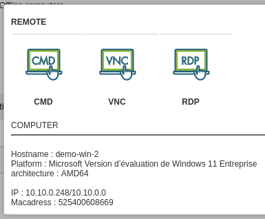

Install Medulla (from download link)
======

Requirements
-----

Medulla need to be installed on Debian linux server, Debian 12 (suggested Partitioning / 20Go ext4 and /var 400Go XFS.

Install Medulla server
-----

Once downloaded, run the following script like:

 source install.sh
Wait until the installation process ends, a summarize will show all needed password (copy in safe place).

To access Medulla interface

 http://dns-server/mmc
ou
 http://ip-server/mmc

Install Medulla agent
======

Medulla agent is downloadable from

http://dns-server/downloads/win

Medulla agent can be installed manually or silently

 Medulla-Agent-windows-FULL-latest.exe /S

The installation process will continue after installation ends, it will install all dependencies.

It ends when the computer appears in Medulla.

First step
=====

At logon, discover the main menu.

Remote desktop example
-----

Do a remote control, find your computer, click on "Remote control"

.. image:: img/remote-desktop.png

Select the remote desktop type to use.

A new tab will be open with remote desktop.

Don't forget to accept popup on your browser

.. image:: img/popup.png

