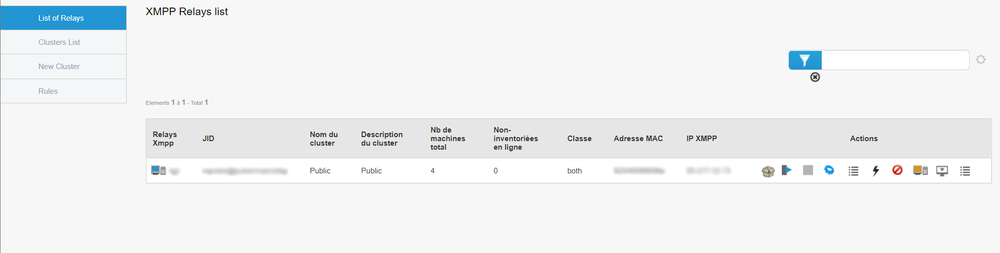
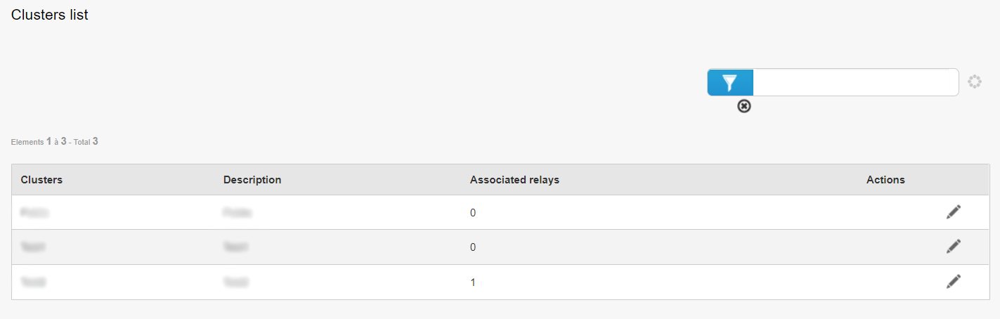
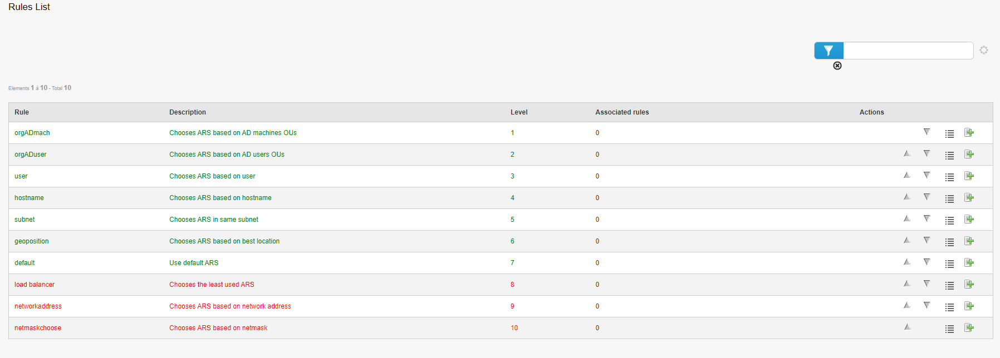

Medulla Admin
=============

This section concerns the Admin part of the Medulla tool.
The Admin menu gathers information about the list of relays.

When clicking on the Admin menu, we directly find the list of our various relays.
The default page is "List of relays", which is the list of relays.

List of relays
==============

On this page, we can find all the information about the relays:
- the name of the relay,
- its JabberID,
- the name of the cluster in which the relay is contained,
- the description of the cluster,
- the number of machines on the relay,
- the online non-inventoried machines present on the relay,
- its class,
- the MAC address of the relay,
- its IP address,
- the possible actions to be launched on the relay.

Regarding the last point, the different actions are as follows:

**Package list**: Displays the list of packages present on the relay,
**Reconfigure machines**: Allows launching the Quick Action for reconfiguring machines on all machines present on the relay,
**Switch**: Allows turning off the relay,
**Edit configuration files**: Allows editing the configuration files of the relay,
**Launched QA**: Displays the list of launched Quick Actions,
**Actions**: Allows launching an action on the relay (Reboot, Process, Disk Usage...),
**Ban**: Bans the relay. It will be considered offline,
**Unban**: Unbans the relay. It can be used again,
**Remote control**: Allows remote control of the relay via VNC, RDP, or SSH,
**Relay rules**: Displays the list of rules on the relay and also allows adding new ones.

List of clusters
================

The list of clusters corresponds to a list of groups of relays.
A cluster can therefore contain one or more relays.
For example, we can create a cluster of several relays so that the machines that connect to this cluster can choose any relay present in the cluster.
This notably allows relieving a relay and having load balancing on the relays.

We can modify a cluster by clicking on the appropriate button. This allows changing the name and/or description of the cluster, or adding and/or removing relays from the cluster.

New cluster
===========

This page allows creating a new cluster.
We can define a name, a description, and add relays to the cluster.
Cluster modification is done on the "List of clusters" page, as seen previously.

Rules
=====

This page contains the list of different rules for relays.
These rules determine which relay the machine should connect to.
Each rule has its level, which determines the order in which the rules should be applied:
For example, when assigning a relay to a station, if at level 1 the rule is "hostname", then we will check the hostname of the machine to link it to the relay.
If it doesn't match, we move on to level 2 (for example "subnet"), which will check the subnet of the machine to link it to the correct relay.
And so on until a rule matches. If nothing matches, the machine will use the default relay (the "default" rule).
