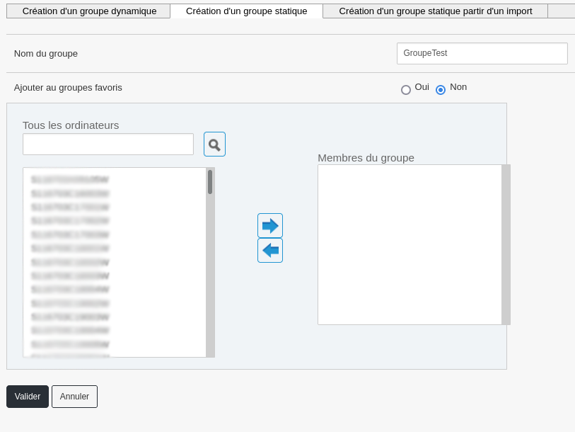
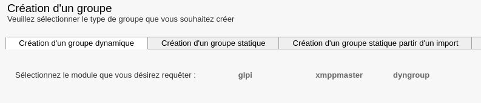
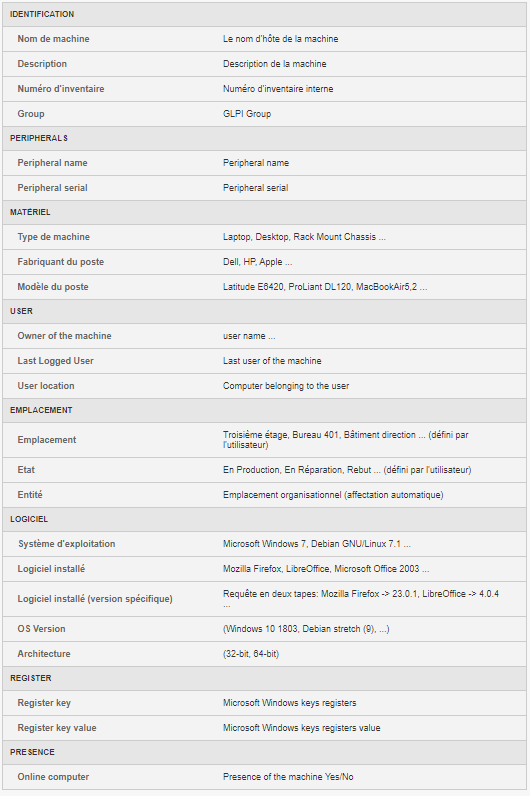
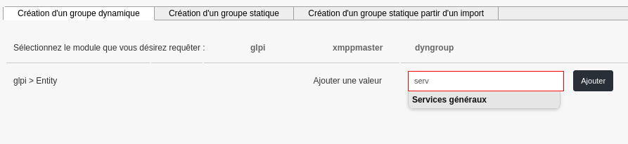
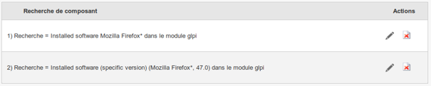
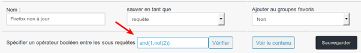

Machine Group
=============

This section covers the Machine Group part of the Medulla tool.

Machine groups allow you to create a set of machines. There are three types of groups:
- Static groups;
- Dynamic groups;
- Groups created from an import.

Static Group
============

In a static group, the selection of member machines is manual.

It is possible to edit a static group to add or remove other machines.
Simply use the arrows to add or remove machines from the group.

Dynamic Group
=============

A dynamic group is a group based on a query on the inventory database of machines based on criteria.
It is possible to combine multiple criteria with Boolean operators.
The result is stored as a query (dynamic) or as a result (fixed at a given time).

Three modules are available for creating dynamic groups:
- GLPI Module: allows the use of machine inventory criteria;
- Xmppmaster Module: allows the use of Active Directory or LDAP;
- Dyngroup Module: allows the use of existing dynamic groups.

Unless specific, always choose "GLPI". Indeed, the query can be performed on different fields, see below:

For example, using the "Entity" field appears as follows:

Auto-completion offers existing values after entering three characters.

Concrete Example of Dynamic Group
---------------------------------

For our example, we will create a machine group where an obsolete version of Firefox is present.
To begin, add a "Software" criterion with the value "Mozilla Firefox *" to test for the presence of Firefox (the "*" character can be used to match any character and thus find all versions of Firefox);
Then, click on "glpi" again to add a second criterion;
Choose "Version" and then enter "Mozilla Firefox *" and "47.0" (this criterion will be inverted, more information just after)
*(The "Version" criterion alone would return machines with either obsolete Firefox OR no Firefox at all)*

Use the auto-completion list to adapt the search criterion as accurately as possible:
For example, Firefox appears with an entry for each version, hence the use of "*".

Once the query is complete, it must be saved.
It is possible to save as a "query" (dynamic) or as a "result" (query at a given time).
If the group is added to the favorite groups, it can be found in the left menu, "Favorite Groups" tab.

Boolean Operator:
~~~~~~~~~~~~~~~~~

The available operators are AND, OR, NOT, as well as ( ).
AND: Allows you to combine queries: AND(1,2)
NOT: Inverts the result of the second query: NOT(2) 
OR: Allows you to use either query: OR(1,2)

For our query, we need to combine the two conditions AND and NOT: AND(1,NOT(2))

This means asking for machines with "Mozilla Firefox *" software installed AND whose version of "Mozilla Firefox *" IS NOT "47.0"
You can check your operators by clicking the "Check" button
It is also possible to view the group's contents before validating by clicking the "View Contents" button
