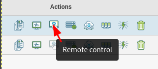
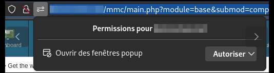

Installer Medulla (à partir du lien de téléchargement)
======================================================

Exigences
---------

Medulla doit être installé sur un serveur Debian Linux, Debian 12 (Partitionnement suggéré / 20Go ext4 et /var 400Go XFS).

Installer le serveur Medulla
----------------------------

Une fois téléchargé, exécutez le script suivant :

 source install.sh

Attendez que le processus d'installation se termine, un résumé affichera tous les mots de passe nécessaires (copiez-les dans un endroit sûr).

Pour accéder à l'interface Medulla

 http://dns-serveur/mmc

ou

 http://ip-serveur/mmc

Installer l'agent Medulla
=========================

L'agent Medulla est téléchargeable depuis

http://dns-serveur/telechargements/win

L'agent Medulla peut être installé manuellement ou en silence

 Medulla-Agent-windows-FULL-latest.exe /S

Le processus d'installation continuera après la fin de l'installation, il installera toutes les dépendances.

Il se termine lorsque l'ordinateur apparaît dans Medulla.

.. image:: img/computer-up.png

Première étape
==============

À la connexion, découvrez le menu principal.

.. image:: img/main-menu.png

Exemple de bureau à distance
----------------------------

Faites un contrôle à distance, trouvez votre ordinateur, cliquez sur "Contrôle à distance"

Sélectionnez le type de bureau à distance à utiliser.

.. image:: img/remote-desktop-type.png

Un nouvel onglet s'ouvrira avec le bureau à distance.

N'oubliez pas d'accepter la fenêtre contextuelle dans votre navigateur

