Gestion des Groupes
============================================

Introduction
============
Ce document va vous ermettre de créer des groupes depuis Medulla et de les synchronisés avec GLPI afin d'attribuer certains droits ACLs à ces groupes.

1. Se rendre sur l’onglet **Groupes** de la console Medulla

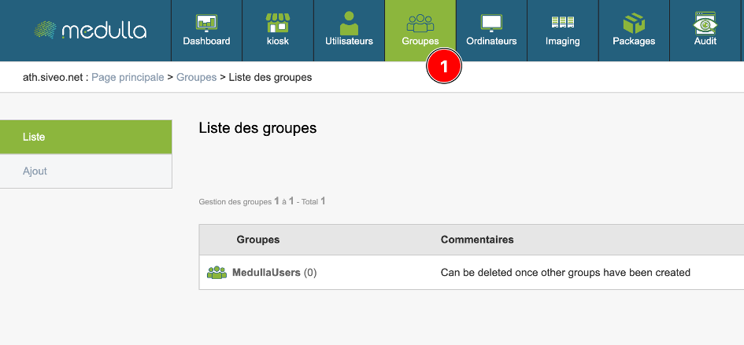

2. Cliquez sur l’onglet **Ajout**

3. Saisissez un nom du *Groupe* et une *Description*

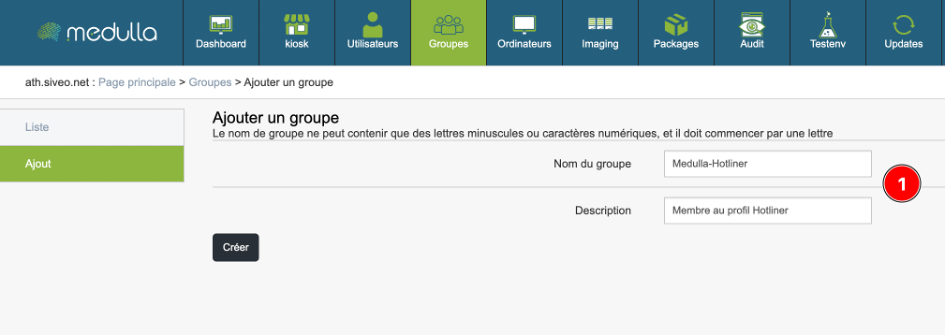

Synchronisation des Groupes dans GLPI
======================================

1. Naviguez dans l’interface GLPI, rendez-vous dans :

   ``Administration > Groupes > Importation de nouveaux groupes``

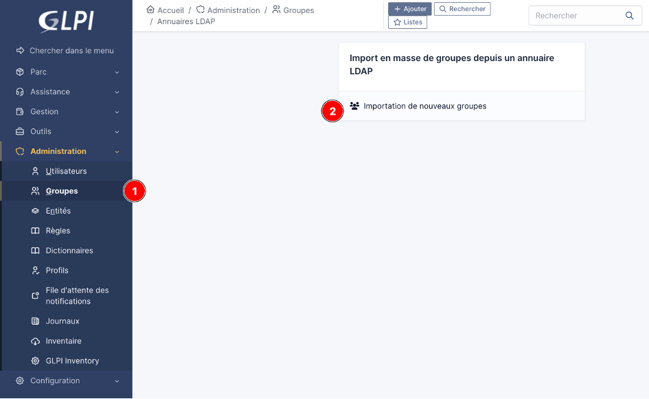

2. Le filtre de recherche par défaut trouve les groupes commençant par **GLPI-***.

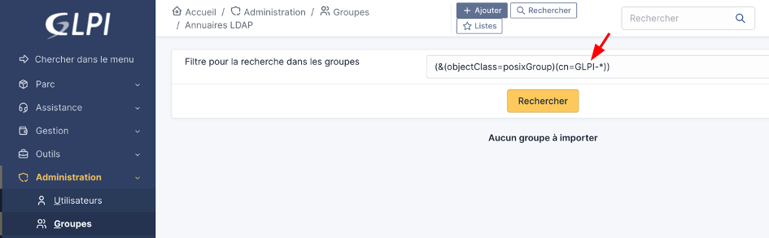

3. Pour synchroniser un groupe nommé différemment, modifiez le filtre de recherche, en supprimant le préfixe **GLPI-***.

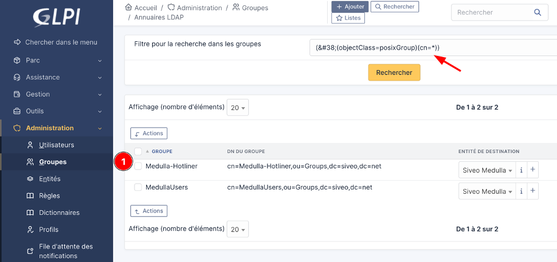

4. Nous pouvons ainsi récupérer le groupe précédemment créé depuis la console Medulla. Il ne vous reste plus qu’à sélectionner le ou les groupes que vous voulez synchroniser et les importer.

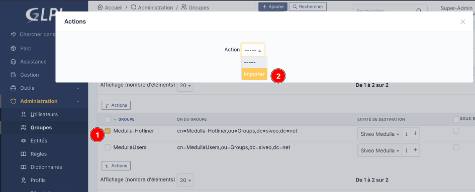

Règles d’affectation d’habilitations à un utilisateur
=======================================================

1. Allez dans :

   ``Administration > Règles > Règles d’affectation d’habilitations à un utilisateur``

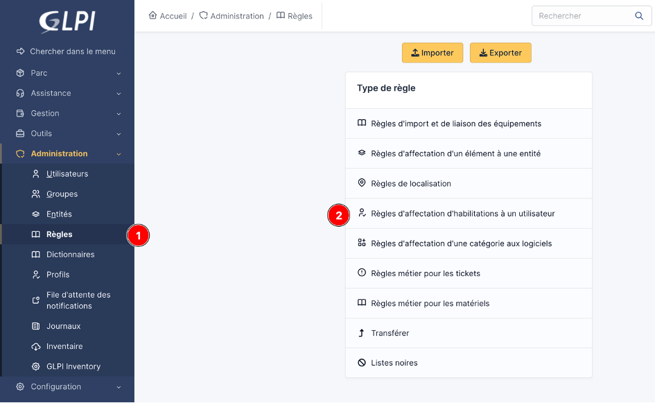

2. Cliquez sur **Ajouter une règle +**

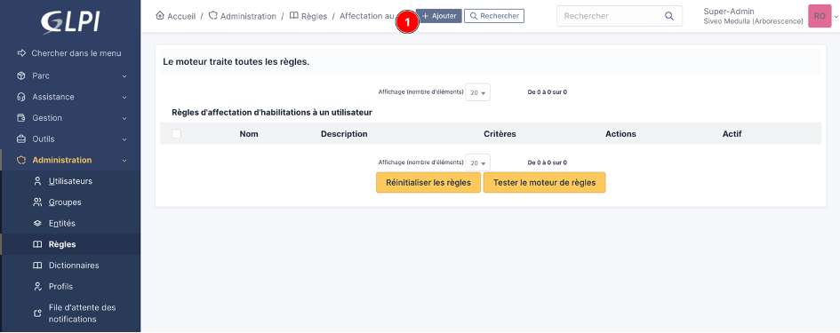

Configuration de la règle
=========================

- Nom : le nom que vous souhaitez donner à votre règle d’affectation d’habilitation
- Actif : bien pensez à mettre sur *OUI* !!

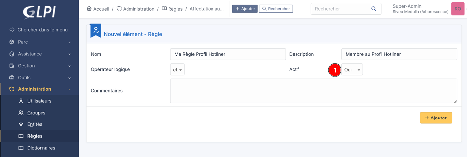

Définition des critères et des actions
======================================

Pour le Critère :

- ``Critère > Critères globaux - Groupe``
- ``Opérateur > Est`` puis sélectionnez le groupe que vous avez synchronisé avec GLPI

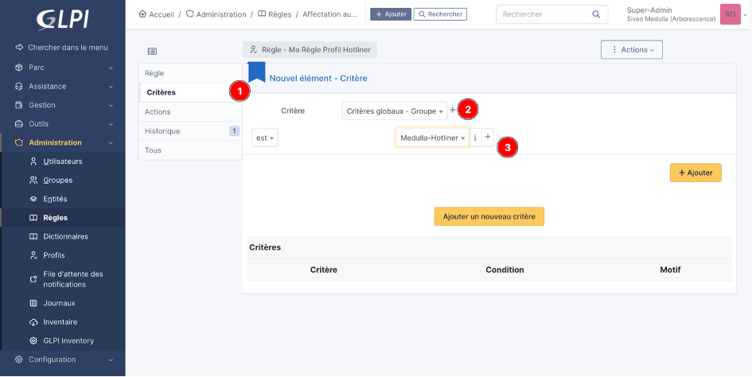

Pour l’Action :

- ``Action > Profils``
- ``Opérateur > Assigner`` puis sélectionnez le profil que vous voulez attribuer à ce groupe

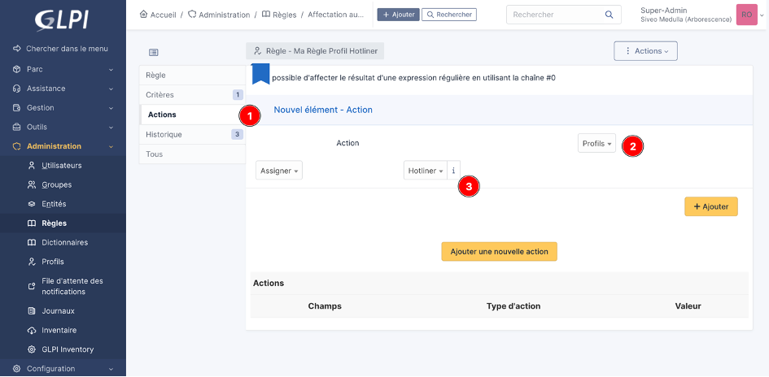

Synthèse des actions
---------------------
Nous avons constitué le groupe **Medulla-Hotliner** via l'interface de Medulla et l'avons par la suite synchronisé avec GLPI. À ce groupe, nous avons appliqué une **règle d'attribution de droits** qui assignera automatiquement le profil **Hotliner** à chaque utilisateur inclus dans ledit groupe, conformément à nos paramètres établis.

Configuration des ACLs (Access Control List)
============================================

1. Accédez à **Utilisateurs** depuis la console Medulla.
2. Cliquez sur l’icône Droits MMC (icône en forme de clé) pour accéder à la gestion des ACLs.

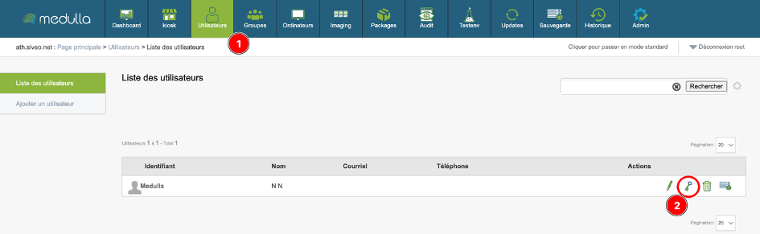

3. Activez le Mode Expert pour télécharger l'ACL, afin de pouvoir télécharger la chaîne de l’ACL

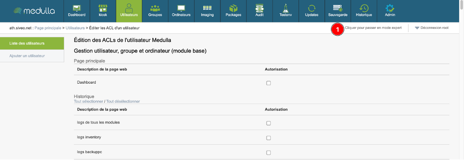

4. Sélectionnez à présent les ACLs que vous voulez pour le profil de notre exmple, *Hotliner*.

   - *En bas de formulaire, nous retrouvons un Bouton pour télécharger cette chaîne*

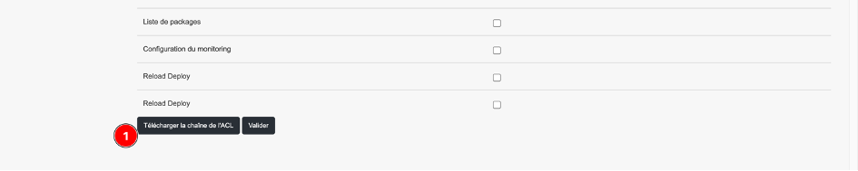

Une fois cette chaîne téléchargée, vous obtenez un fichier nommé `<id_utilisateur>-acl.txt`

Configuration des ACLs depuis le fichier de configuration
=========================================================

1. Sur le serveur dans le fichier de configuration qui se situe à cet emplacement :

    ``/etc/mmc/plugins/glpi.ini.local``

On retrouve dans ce fichier 2 parties qui vont nous intéresser :

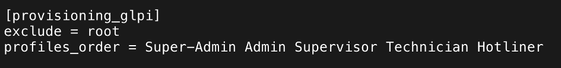

2. Dans *profiles_order*, on retrouve différents profils par défaut, dont *Hotliner* qui est déjà défini.

- Vous pouvez également modifier les ACLs pour les profils par défaut, par exemple *Technicien* ou *Administrateur*. Il vous suffit donc de supprimer la chaîne ACL actuelle et de la remplacer par celle que vous avez téléchargée précédemment.

3. Si vous avez choisi un autre nom de profil mais que vous voulez attribuer des ACLs particulières, vous pouvez ajouter le nom du Profil, par exemple **Conformite**.

Cette partie est à modifier si vous avez choisi un autre nom de profil que ceux par défaut.

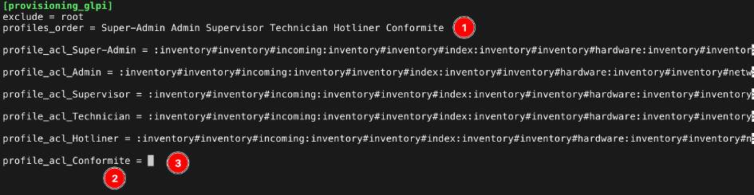

1/ Le nom du profil

2/La création d’une nouvelle ligne pour la chaîne ACL, bien reprendre

   ``profile_acl_<Nom_du_Profil>``

3/ Coller la chaîne ACL précédemment téléchargée

**IMPORTANT : Si vous attribuez un autre Profil que ceux définis par défaut, il faut bien sûr que ce Profil soit présent dans votre GLPI. Si ce n’est pas le cas, vous pouvez vous rendre dans l’interface GLPI puis : Administrations > profils > Ajouter**

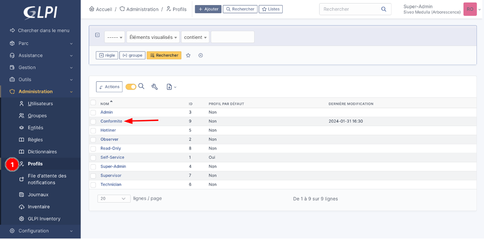

4. Une fois les modifications effectuées, enregistrez le fichier de configuration. Pour que les modifications soient prises en compte, redémarrez le service MMC-Agent :

    ``systemctl restart mmc-agent``
