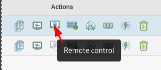
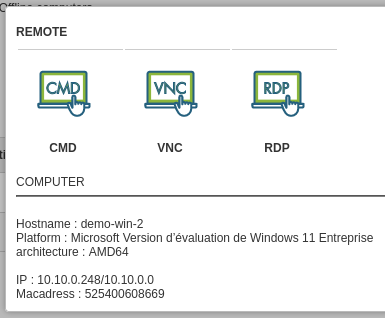
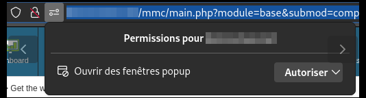

Prise en main à distance
------------------------

Pour accéder aux différents mode de prise en main à distance, cliquer sur "Remote control"

Selectionner le type de PMAD:

* VNC pour assister l'utilisateur
* RDP pour ouvrir session distante
* CMD pour ouvrir une console (batch ou powershell) distante

Un onglet du navigateur s'ouvre avec la PMAD

Ne pas oublier d'accepter l'ouverture de fenêtre venant de Medulla

