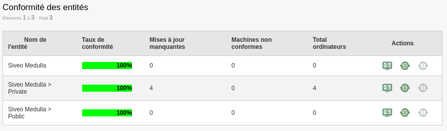
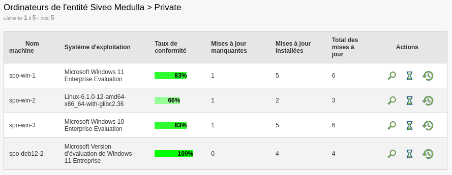
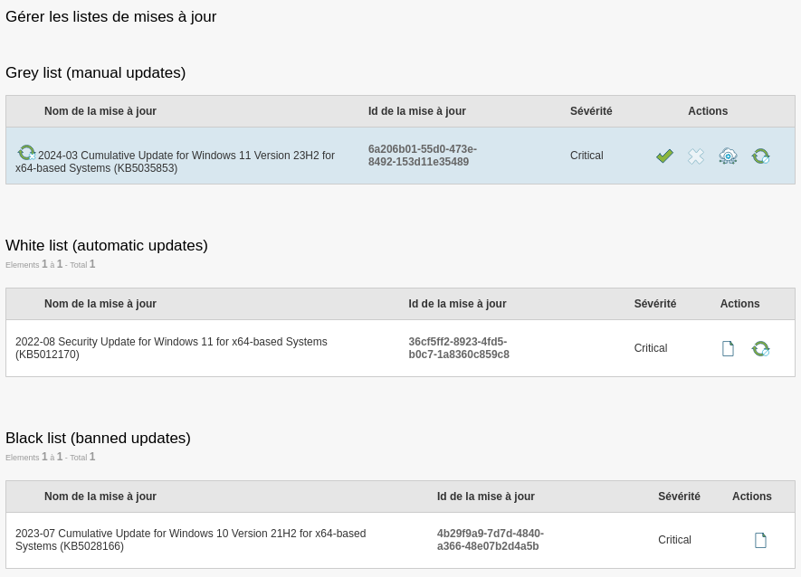

Gestion mise à jour Windows
---------------------------

Le module de mise à jours Windows permet de superviser la sécurité et la conformité des postes Windows.

La vue principale montre la conformité du parc par entité

Il existe plsuieurs vues de conformité

* par entité
* par mise à jour
* par machine

Exemple de la vue pour une entité spécifique

Depuis le menu de gauche, on accède à la gestion et qualification des mises à jours. 

La gestion des mises à jours est divisée en trois listes :

* Grises : Les mises à jours demandées par les postes qui nécessitent une qualification
* Blanches : Liste des mises à jour qualifiées pour un déploiement automatiques
* Grises : Liste des mises à jours bannies qui ne seront jamais déployées

Pour chacune des mises à jours, il est possible de mener plusieurs actions

* Activer pour mise à jour manuelle
* Désactiver pour mise à jour manuelle
* Approuver pour mise à jour automatique
* Bannir la mise à jour

