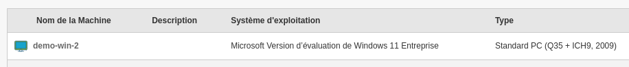

Medulla agent
=============

L'agent Medulla est téléchargeable depuis

http://dns-serveur/telechargements/win/Medulla-Agent-windows-FULL-latest.exe

L'agent Medulla peut être installé manuellement ou en silencieux.

 Medulla-Agent-windows-FULL-latest.exe /S

Le processus d'installation continuera après la fin de l'installation, il installera toutes les dépendances.

Il se termine lorsque l'ordinateur apparaît dans Medulla en bleu (en ligne).

